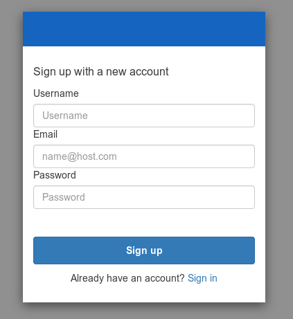

# Quick Start

Zero-to-data quick start for independent people. This guide will walk you through creating an account, setting up a Docker container containing the client software on your machine, and downloading meter data for an example application.

## Create An Account

Go to the [mortardata.org](https://mortardata.org/#/) website and find the Sign Up link. Make an account and make note of your username and password. It should look something like this:



## Install Prerequisites

The easiest way to run the Mortar client is with the [mortar/pymortar-client:latest Docker image](https://cloud.docker.com/repository/docker/mortar/pymortar-client).

To get this to work, you need to install:

- Docker ([installation instructions](https://docs.docker.com/install/))
- git
- openssl

## Generate TLS Certificates

If you are going to be hosting the Docker container on a remote machine, you should set up TLS certificates.

Save the following into a shell script called `generate-certs.sh`:

```bash
# generate-certs.sh
mkdir -p certs
if [ ! \( -f "certs/mortar-client.key" -a -f "certs/mortar-client.pem" \) ]; then
    openssl req -x509 -nodes -days 365 -newkey rsa:2048 -keyout certs/mortar-client.key -out certs/mortar-client.pem
fi
```

Run the script once and follow the prompts; once the certificates are generated, they do not need to be re-generated.

## Run the Docker Container


### Clone `mortar-analytics` Repository
If you want to access the library of Mortar analytics, clone the [mortar-analytics repository](https://github.com/SoftwareDefinedBuildings/mortar-analytics) into a folder called `mortar-analytics`

```bash
git clone https://github.com/SoftwareDefinedBuildings/mortar-analytics mortar-analytics
```

### Configure Mortar Credentials

A convenient way of authenticating to the Mortar service is just to include your username and password in your environment. Edit `~/.bashrc` and add the following lines

```bash
export MORTAR_API_USERNAME='your username'
export MORTAR_API_PASSWORD='your password'
```

Then reload your `~/.bashrc` file with

```bash
source ~/.bashrc
```

### Running with TLS

If you generated TLS certificates above, you can run the Docker container as follows:

```bash
docker run -p 8888:8888 --name mortar \
    -v `pwd`/mortar-analytics:/home/jovyan/mortar-analytics \
    -v `pwd`/certs:/certs \
    -e USE_HTTPS=yes \
    -e MORTAR_API_ADDRESS=mortardata.org:9001 \
    -e MORTAR_API_USERNAME=$MORTAR_API_USERNAME \
    -e MORTAR_API_PASSWORD=$MORTAR_API_PASSWORD \
    --rm mortar/pymortar-client:latest
```

### Running without TLS

Why would you run without TLS?

Anyway you might be able to do it with

```bash
docker run -p 8888:8888 --name mortar \
    -v `pwd`/mortar-analytics:/home/jovyan/mortar-analytics \
    -e MORTAR_API_ADDRESS=mortardata.org:9001 \
    -e MORTAR_API_USERNAME=$MORTAR_API_USERNAME \
    -e MORTAR_API_PASSWORD=$MORTAR_API_PASSWORD \
    --rm mortar/pymortar-client:latest
```

